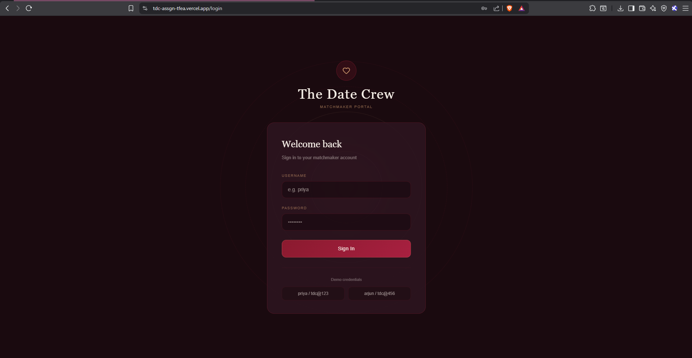
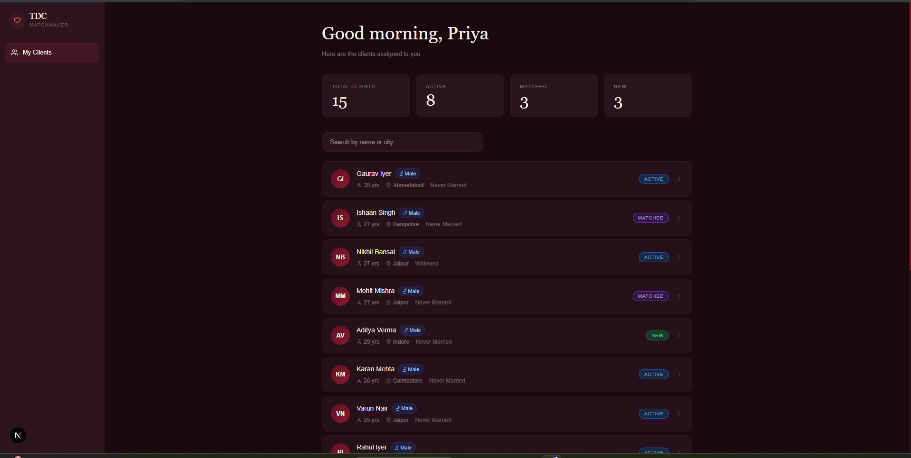
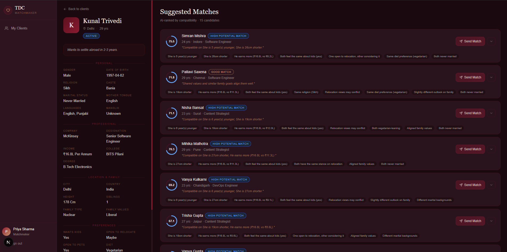

# TDC Matchmaker Dashboard

An internal matchmaking dashboard for **The Date Crew** — a premium Indian matrimonial service. Built for matchmakers to manage client profiles, view AI-ranked match suggestions, and send curated introductions.

## Screenshots








**Live Demo:** [tdc-dashboard.vercel.app](https://tdc-assgn-tfea.vercel.app)  
**Backend API:** [tdc-assgn.onrender.com](https://tdc-assgn.onrender.com)

**Sample credentials:**
| Username | Password |
|----------|----------|
| priya    | tdc@123  |
| arjun    | tdc@456  |

---

## Features

- JWT-authenticated matchmaker login
- Dashboard with assigned client list, status tracking, and search
- Full biodata view (30+ fields covering Indian matrimonial context)
- AI-powered match ranking — rule-based scoring + Groq (Llama 3.3) explanations
- Gender-specific matching logic
- Send Match modal with personalised email preview

---

## Tech Stack

**Frontend:** Next.js 14 (App Router), TypeScript, Tailwind CSS  
**Backend:** FastAPI, Python, Pydantic  
**AI:** Groq API (Llama 3.3-70b) for match explanations  
**Auth:** JWT via `python-jose` + `passlib`  
**Data:** Static JSON (30 customers, 120 pool profiles)  
**Deploy:** Vercel (frontend) + Render (backend)

---

## Project Structure

```
tdc-assgn/
├── backend/
│   ├── main.py               # FastAPI app entry point
│   ├── auth.py               # JWT auth + matchmaker accounts
│   ├── models.py             # Pydantic models
│   ├── requirements.txt
│   ├── runtime.txt           # Python 3.11 for Render
│   ├── data/
│   │   ├── customers.json    # 30 assigned client profiles
│   │   └── profiles_pool.json # 120 match pool profiles
│   ├── matching/
│   │   └── algo.py           # Core matching algorithm
│   └── routes/
│       ├── auth_route.py
│       ├── customers.py
│       ├── matches.py
│       └── send_match.py
└── frontend/
    ├── app/
    │   ├── login/page.tsx
    │   ├── dashboard/
    │   │   ├── page.tsx
    │   │   └── customers/[id]/page.tsx
    │   ├── components/
    │   │   └── SendMatchModal.tsx
    │   ├── lib/
    │   │   ├── api.ts
    │   │   └── auth-context.tsx
    │   └── types/index.ts
    └── tailwind.config.ts
```

---

## API Routes

| Method | Route | Description |
|--------|-------|-------------|
| POST | `/auth/login` | Returns JWT token |
| GET | `/customers` | Assigned customer list |
| GET | `/customers/{id}` | Full customer biodata |
| GET | `/matches/{customer_id}` | AI-ranked match suggestions |
| POST | `/send-match` | Mock email preview |

---

## Local Setup

**Backend**
```bash
cd backend
python -m venv venv
venv\Scripts\activate       # Windows
pip install -r requirements.txt
cp .env.example .env        # add your GROQ_API_KEY
uvicorn main:app --reload --port 8000
```

**Frontend**
```bash
cd frontend
npm install
# create .env.local with:
# NEXT_PUBLIC_API_URL=http://localhost:8000
npm run dev
```